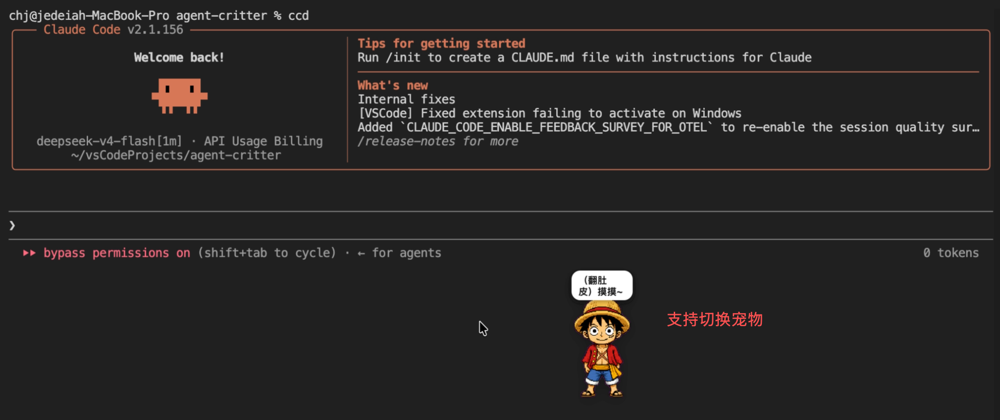
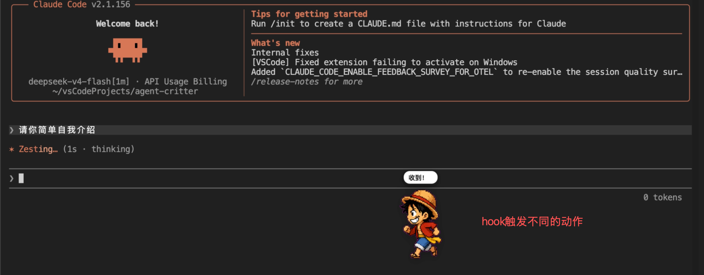
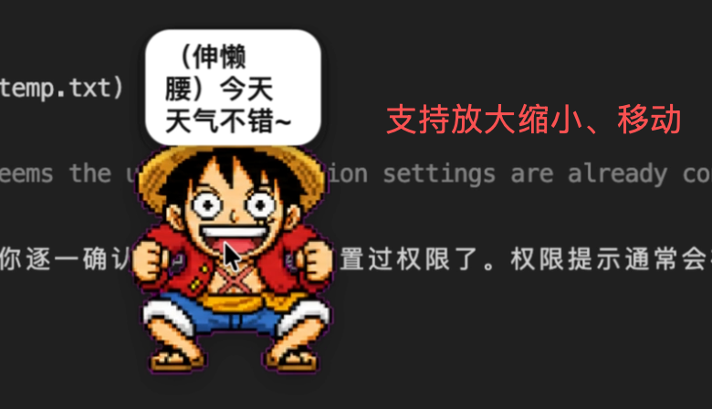
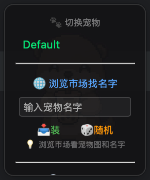
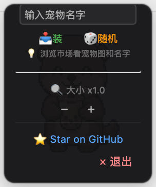

# Agent Critter 🐱

[](https://www.rust-lang.org/)
[](LICENSE)
[](https://petdex.dev)
[](https://www.claudepluginhub.com/plugins/jedeiah-agent-critter)

> **🌏 [English](README.en.md) · 中文**

> **跨平台支持：** macOS 和 Windows 11 已测试。

**Agent Critter** 是一个 Claude Code 桌宠插件 —— 一只实时展示你的 AI 编程助手工作状态的小精灵。支持 [Petdex](https://petdex.dev) 社区 2700+ 精灵，一键切换。透明窗口、可拖拽、可缩放。

---

## 预览

| 待机 | 工作中 | 放大 |
|------|--------|------|
|  |  |  |

---

## 安装

### 前置条件

- [Claude Code](https://code.claude.com) CLI（插件模式）
- 或：macOS / Windows 系统（独立运行模式）

### 通过插件市场安装（推荐）

```bash
# 添加 marketplace
/plugin marketplace add github.com/Jedeiah/agent-critter

# 安装插件
/plugin install agent-critter@agent-critter

# 重载插件
/reload-plugins
```

或通过交互菜单安装：

1. 在 Claude Code 中输入 `/plugin`
2. 选择 **Marketplaces** → **Add Marketplace**
3. 输入 `Jedeiah/agent-critter`
4. 回到 **Plugins**，找到 `agent-critter`，选择 **Install**
5. 输入 `/reload-plugins`

安装后桌宠自动启动。

### 从 Release 安装

从 [Releases](https://github.com/Jedeiah/agent-critter/releases) 下载对应平台的插件包，解压后运行：

```bash
# macOS
./bin/agent-critter --daemon

# Windows
bin\agent-critter.exe --daemon
```

### 从源码构建

```bash
cargo build --release

# 打包插件（可选）
bash scripts/build-plugin.sh   # macOS / Linux
# 或
.\scripts\build-plugin.bat     # Windows
```

---

## 使用说明

桌宠启动后会以透明窗口形式悬浮在屏幕最上层，实时反映 Claude Code 的工作状态。

### 交互方式

| 操作 | 效果 |
|------|------|
| **单击宠物** | 随机互动文案 + 动作（挥手 / 跳跃 / 等待 / 审查） |
| **双击宠物** | 显示当前会话数和状态气泡 |
| **拖拽** | 移动桌宠位置（拖拽背景区域） |
| **右键** | 打开功能菜单 |

### 右键菜单

| 切换宠物 / 市场 / 安装 | 大小 / GitHub / 退出 |
|------------------------|---------------------|
|  |  |

右键桌宠弹出全屏菜单（分上下两部分）：

```
🐾 切换宠物
  ├─ Boba / Dwight / ...    ← 已安装的宠物，点击切换
  ├──────────────────────
  🔍 大小 x1.0  [−]  [+]   ← 缩放 0.5x ~ 1.5x
  ├──────────────────────
  🌐 浏览市场找名字          ← 打开 Petdex 合集页面
  📥 [输入框] 装             ← 输入名字安装新宠物
  🎲 随机                    ← 随机安装一个宠物
  ├──────────────────────
  ⭐ Star on GitHub          ← 打开项目主页
  × 退出                     ← 关闭桌宠
```

### 安装更多宠物

内置宠物市场，无需 Node.js：

```bash
# 右键菜单中直接输入名字安装，或点"随机"
# 也可用命令行（需 Node.js）：
npx -y petdex install <宠物名字>
```

支持 Petdex 社区 2700+ 精灵，浏览合集：[https://petdex.dev/collections](https://petdex.dev/collections)

### 状态映射

Claude Code 的状态变化会自动切换桌宠动画：

| AI 状态 | 宠物动画 | 说明 |
|---------|---------|------|
| 空闲 | 😴 呼吸待机 | 无活动时，30s 后概率触发闲时互动，2h 后自动休眠 |
| 工作中 | 🏃 左右奔跑 | 处理用户请求、执行工具调用时 |
| 等待确认 | ⏳ 等待 | 权限请求、弹窗确认时 |
| 工具异常 | 🔍 审查中 | 工具调用失败、限流时 |
| 严重错误 | 💥 崩溃 | 认证失败、账单错误、模型不存在时 |

---

## Hook 事件

Claude Code 通过以下 hook 事件驱动桌宠状态：

| Hook 事件 | 映射状态 | 触发时机 |
|-----------|---------|----------|
| `SessionStart` | session_start | 会话开始 / 压缩完成 |
| `PerCompact` | running | 压缩真正开始 |
| `UserPromptSubmit` | running | 用户提交 prompt |
| `PreToolUse` | running | 工具调用前 |
| `PostToolUse` | running | 工具调用后 |
| `PermissionRequest` | need_confirm | 权限请求 |
| `Notification` | idle / need_confirm | 通知消息 |
| `Stop` | idle | 停止 |
| `StopFailure` | tool_error / error_final | 停止失败 |
| `PostToolUseFailure` | tool_error / stop | 工具调用失败 |
| `SessionEnd` | session_end | 会话结束 |

所有 hook 配置见 [`hooks/hooks.json`](hooks/hooks.json)。

---

## 架构

```
Claude Code Hooks ──TCP(7890)──▶ StateMachine ──evaluate_script()──▶ WebView
     (JSON)                        (多会话)         (瞬时推JS)         (CSS动画)
```

| 层 | 技术 |
|----|------|
| 窗口 | wry + tao（macOS WKWebView / Windows WebView2） |
| 渲染 | CSS background-image + JS setTimeout 逐帧 |
| 状态机 | Rust StateMachine（多会话优先级合并） |
| Hook | TCP JSON（Claude Code plugin hooks） |
| 精灵 | Petdex 8×9 spritesheet（webp） |

### 多会话优先级

多个 Claude Code 会话同时运行时，桌宠取最高优先级状态：

`ErrorFinal > ToolError > NeedConfirm > Running > Idle`

---

## 配置

所有配置持久化在 `~/.agent-critter/data/`：

| 文件 | 内容 | 说明 |
|------|------|------|
| `position` | `x\ny` | 窗口位置（像素坐标） |
| `pet-slug` | `boba` | 当前选中的宠物 slug |
| `pet-scale` | `1.0` | 缩放比例（0.5 ~ 1.5） |

首次启动默认显示在屏幕右下角。

---

## 宠物存储

桌宠扫描以下目录加载已安装的宠物精灵：

| 目录 | 说明 |
|------|------|
| `~/.codex/pets/<name>/` | 主目录（自动创建） |
| `~/.petdex/pets/<name>/` | 旧版 Petdex 兼容目录 |

每个宠物一个文件夹，内含 `spritesheet.webp`（或 `.png`）即可。

---

## 卸载

```bash
/plugin uninstall agent-critter
```

如需完全清理数据：

```bash
rm -rf ~/.agent-critter
```

---

## 故障排除

| 问题 | 解决方法 |
|------|---------|
| **桌宠不显示** | `pkill agent-critter` 后重启 Claude Code |
| **端口 7890 被占用** | `pkill agent-critter` 或更换端口 |
| **宠物图片不显示** | 检查 `~/.codex/pets/<name>/spritesheet.webp` 是否存在 |
| **Windows 白线/边框** | 自动处理，如仍有问题请提 Issue |

---

## 路线图

- [x] Claude Code 实时状态同步
- [x] 精灵市场内置（搜索安装 / 随机）
- [ ] 适配更多 Agent（Codex CLI / OpenCode / Gemini CLI）
- [ ] 更多 Hook 事件（Subagent、Compact 等）
- [ ] 宠物语音（状态切换音效 / TTS）
- [ ] 主题系统（自定义 UI 配色）

---

## 致谢

- [Petdex](https://github.com/crafter-station/petdex) — 精灵格式、HTML 模板参考
- [wry](https://github.com/nicehash/wry) — Rust WebView 库
- [tao](https://github.com/tauri-apps/tao) — 跨平台窗口

## 许可证

[MIT](LICENSE)
